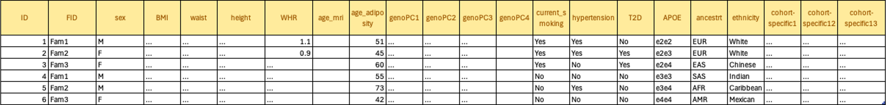
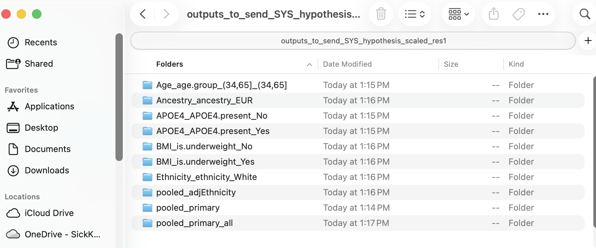

# NeuroCHARGE_obesity_ctxVol
Scripts to run adiposity-ctx structure associations
# Script instructions
1. Download the script and related files.
2. Format data (see below)
3. Move the formatted data files to the same directory where the scripts are.
4. Edit 'cohort_specific_inputs.R'
5. Edit and run 'run_protocols.R'
6. When you complete #3, please compress the `outputs_to_send_COHORT` directory and email it to Jean Shin (jjshin.research@gmail.com).
   
# File formatting instructions

## File 1: `neuro` file

**Notes:** - The column names **and their order** must exactly match those in
[neuro_columns.txt](neuro_columns.txt), which contains names for the FreeSurfer-parcellated regions, left and right hemispheres, and ICV.
- Include the following 212 variables:
1.  `ID` Participant ID (n=1)
2.  Cortical volume for the 68 FreeSurfer-parcellated regions in the left and right hemispheres (n=68)
3.  Cortical thickness for the 68 FreeSurfer-parcellated regions in the left and right hemispheres (n=68)
4.  Cortical surface area for the 68 FreeSurfer-parcellated regions in the left and right hemispheres (n=68)
5.  Total cortical volume for the left and right hemispheres (n=2)
6.  Average cortical thickness in the left and right hemispheres (n=2)
7.  Total cortical surface area for the left and right hemispheres (n=2)
8.  Intracranial volume (ICV) (n=1)

------------------------------------------------------------------------

## File 2: `non.neuro` file

This file must include all of the following non-brain types of variables (i.e., adiposity, genotypes, genetic PCs, and any cohort-specific variables). **Please be sure to use the same unit/coding as instructed.** The required column names are listed in [non.neuro_columns.txt](non.neuro_columns.txt).

| Variable | Description (unit or coding)      | Note                                               |
|-------------|---------------------------------------|---------------------------------------------|
| `ID`     | Participant ID                    |                                                    |
| `FID`    | Family ID (same as `ID` if unrelated)|                                                 |
| `sex`    | Sex (`M/F`)                       |                                                    |
| `BMI`    | Body mass index (kg/m²)           |                                                    |
| `waist`  | Waist circumference (cm)          |                                                    |
| `height` | Height (cm)                       |                                                    |
| `WHR`    | Waist Hip Ratio: Waist circumference (cm) / Hip circumference (cm)|                    |
| `age_adiposity`| Age at adiposity measurement (years)|                                            |
| `age_mri`| Age at MRI scan (years) |If it was taken at the time of adiposity measurement, put `age_adiposity`.|
| `genoPC1` – `genoPC4` or more | The first >=4 leading principal component scores.|At least 4 top PCs will be included.|
| `current_smoking`| Current smoking staaus (`Yes/No`)|                                             |
| `hypertension`| Has hypertension? (`Yes/No`) |                                                    |
| `T2D`    | Has type 2 diabetes? (`Yes/No`)   |                                                    |
| `APOE` | APOE genotypes: coded as `e2e2`, `e2e3`, `e2e4`, `e3e3`, `e3e4`, or `e4e4` |             |
| `ancestry` | AFR (African), AMR (American), EAS (East Asian), EUR (European), SAS (African)| Contact us if you have non-European ancestries and need to genetically infer ancestries: We will provide scripts. |
| `ethnicity` | e.g., White, African American, Chinese, ... |                                       |

------------------------------------------------------------------------
## Example data frame for the `non-neuro` file:

**End of File formatting instructions**

# Outputs
1. After running all the scripts, several subfolders will be automatically created in the output_to_send_XXX directory: 

2. Each subfolder should contain the output files listed in . Please note: if the sample size is too small for **stratified analyses** or **sex-specific adjustments** of brain and/or adiposity variables (for covariates), only **log files** may be generated instead of full output files. 
